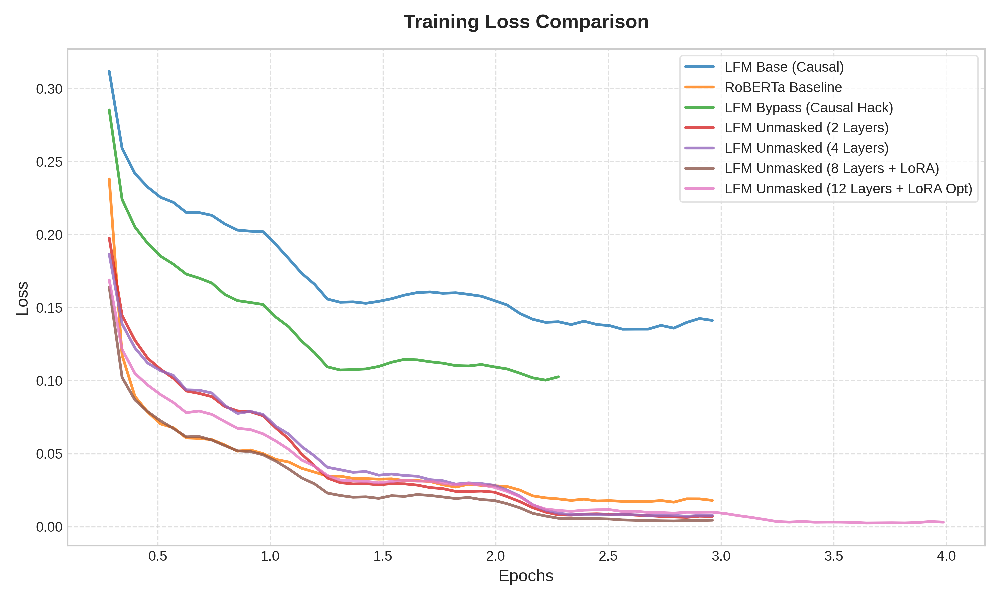
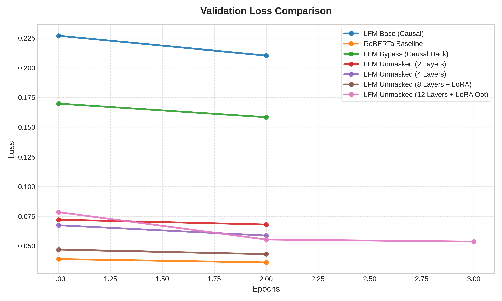
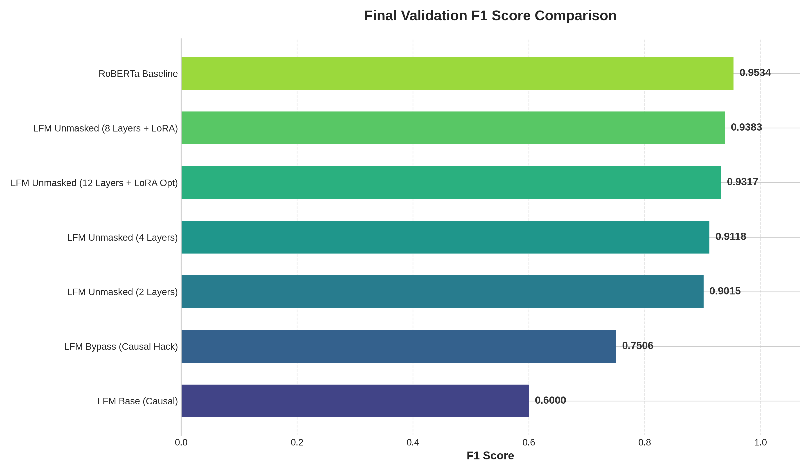
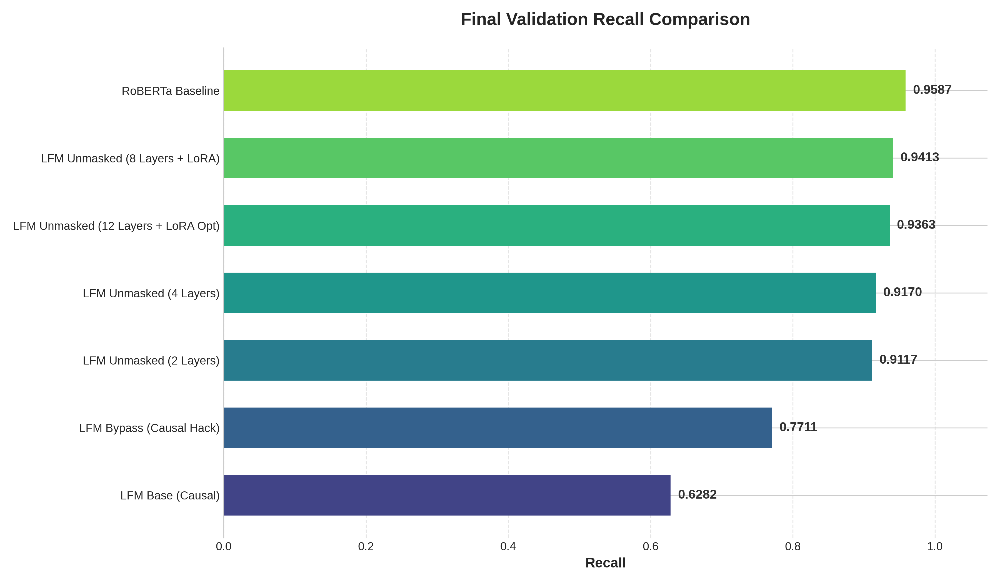

# Named Entity Recognition Experiments: LiquidAI LFM2.5-350M vs RoBERTa

This report summarizes a series of experiments conducted on the `conll2003` Named Entity Recognition (NER) dataset. The core objective was to evaluate and optimize the performance of `LiquidAI/LFM2.5-350M`, a causal small language model, by bypassing or removing its causal masking constraints to emulate bidirectional processing, comparing it directly against the fully bidirectional `roberta-base` benchmark.

---

## 📊 Final Metric Comparison (Test Set)

The following table lists the final evaluation metrics computed on the `conll2003` test dataset.

| Model Setup | Trainable Layers | Precision | Recall | F1 Score | Accuracy |
| :--- | :--- | :--- | :--- | :--- | :--- |
| 🏆 **RoBERTa Baseline** | All (Full FT) | **0.9145** | **0.9283** | **0.9213** | **0.9836** |
| **LFM Unmasked (8 Layers + LoRA)** | LoRA (Layers 8-15) | 0.8914 | 0.9071 | **0.8992** | 0.9801 |
| **LFM Unmasked (12 Layers + LoRA Opt)** | LoRA (Layers 4-15) | 0.8689 | 0.8911 | 0.8799 | 0.9777 |
| **LFM Unmasked (4 Layers)** | Last 4 (Full FT) | 0.8637 | 0.8844 | 0.8739 | 0.9765 |
| **LFM Unmasked (2 Layers)** | Last 2 (Full FT) | 0.8307 | 0.8652 | 0.8476 | 0.9740 |
| **LFM Bypass (Causal Hack)** | Custom Head Only | 0.6640 | 0.7215 | 0.6915 | 0.9484 |
| **LFM Base (Causal)** | Custom Head Only | 0.5325 | 0.5921 | 0.5607 | 0.9291 |

---

## 🧪 Individual Experiment Breakdown

### 1. LFM Base (Standard Causal)
* **Details:** Frozen `LFM2.5-350M` base with a trainable 2-layer MLP classifier on top. Causal masking was fully preserved.
* **Observation:** Performed poorly (F1: 0.56). Because token-level representations can only "look back" at previous tokens, the model completely lacked future context necessary to detect entity boundaries (e.g., knowing if "York" follows "New").

### 2. RoBERTa Baseline
* **Details:** Fully fine-tuned `roberta-base` for 3 epochs. 
* **Observation:** Our gold standard (F1: 0.921). As an encoder-only bidirectional transformer, it benefits naturally from full context in both directions for every token.

### 3. LFM Bypass (The Duplication Hack)
* **Details:** Preprocessed input as `w1 w2 w3 <eos> w1 w2 w3`. Evaluated metrics on the duplicated (second) sequence where the causal model had already processed the context.
* **Observation:** Massive jump (F1: 0.692). Proved our hypothesis that causality was the primary performance bottleneck. However, doubling sequence length incurs quadratic computational costs.

### 4. LFM Unmasked (Last 2 Layers)
* **Details:** Patched `Lfm2Model.forward` to supply expanded non-causal masks to the last 2 layers (`14` & `15`). Modified the final `Lfm2ShortConv` outputs to use centered slicing. Unfroze these layers and trained for 3 epochs.
* **Observation:** High leap (F1: 0.848). Proved that locally unmasking the end of the network is a highly efficient way to dynamically inject bidirectional information.

### 5. LFM Unmasked (Last 4 Layers)
* **Details:** Extended architectural unmasking to the last 4 layers (`12` through `15`). Fully fine-tuned these layers.
* **Observation:** Performance increased substantially (F1: 0.874), demonstrating that deepening the bidirectional receptive field directly translates to higher classification quality.

### 6. LFM Unmasked (8 Layers + LoRA) - 🌟 *Best LFM Result*
* **Details:** Unmasked the entire late half of the network (8 layers: `8` to `15`). Applied **LoRA** (`r=16`, `alpha=32`) to attention and convolution modules to manage parameter scale.
* **Observation:** Outstanding results (F1: 0.899). Achieved extreme parity with RoBERTa, proving that unmasking a large portion of a pre-trained model coupled with parameter-efficient tuning is a powerhouse approach.

### 7. LFM Unmasked (12 Layers + LoRA Optimized)
* **Details:** Pushed further by unmasking 12 layers (`4` to `15`) and increased capacity with LoRA (`r=64`, `alpha=128`) across 4 epochs.
* **Observation:** Performance saw a slight regression (F1: 0.880). 
* **Hypothesis:** Unmasking too early in a model that was pre-trained strictly causally likely disrupts the fundamental feature extraction hierarchy. Early layers should remain causal to extract robust linguistic features, while later layers act as the bidirectional "mixer."

---

## 📈 Metric Comparison Plots

To better understand the convergence behavior across these architectures, we isolated training and validation metrics over the epochs.

### 📉 Training Loss Comparison
Smoothed training loss across epochs shows that unmasked architectures converge faster and experience far steeper gradient curves compared to standard causal setups.

### 🔍 Validation Metric Evolution
Below are the separate evaluation metrics logged per validation checkpoint (at the end of each epoch).

#### 📉 Validation Loss
Notice how the unmasked LoRA and 4-layer models hit far lower validation losses than the causal models.

#### 🎯 Final Validation F1 Score
The horizontal bar chart below ranks the final checkpoint F1 scores, clearly placing the 8-layer LoRA run right underneath RoBERTa as the superior LFM architecture.

#### 📊 Final Validation Precision & Recall
Comparing final precision and recall metrics demonstrates that architectural unmasking scales both values proportionally, helping equally with finding entities (Recall) and reducing false positives (Precision).

| Validation Precision | Validation Recall |
| :---: | :---: |
|  |  |

---

## 🎯 Conclusion and Recommendations

1. **Unmasking is highly scalable:** Architectural unmasking reliably bridges the gap between causal and bidirectional models for token classification.
2. **Sweet Spot (8-Layer + LoRA):** Keeping the first half of the LFM causal (preserving fundamental feature extraction) while letting the latter half become fully bidirectional is the optimal architecture configuration. It hit an impressive **0.899 F1** vs RoBERTa's **0.921 F1**.
3. **Recommendation for Clinical Transition:** When moving to the real discharge summary dataset, we strongly recommend utilizing the **8 Layers Unmasked + LoRA** setup. It offers the absolute best compromise of high bidirectional context capacity and compute efficiency.
